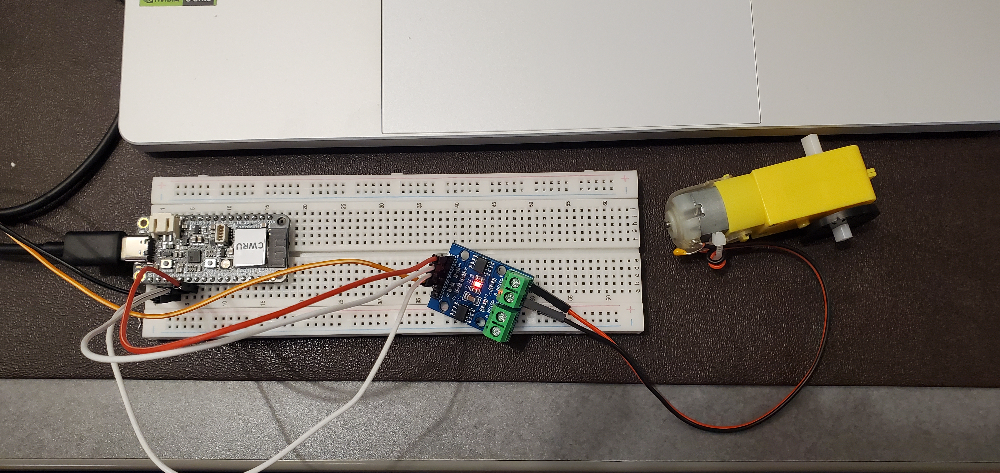
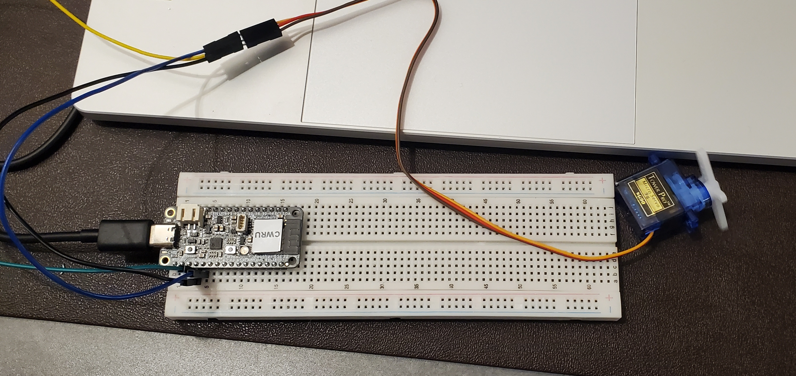

# Lab 4: Actuators and Sensors
## Submitted by Martin Lopez

This is the third lab using the ESP32 Feather V2 board. This lab is focused on connecting actuators to the ESP32.

I will use the PlatformIO commandline tools and a text editor (Neovim) in Linux to complete the lab.

The files starting with "TT Motor" utilize a TT Motor and a motor driver module. The circuit can be seen below.

The code in "TT Motor.cpp" rotates the TT Motor for five seconds and stops. The code in "TT Motor Rotate.cpp" rotates it continually in a loop 

The files starting with "Servo Motor" utilize a servo motor. the circuit can be seen below.

The code in "Servo Motor.cpp" controls the servo to move 180 degrees both clockwise and counter-clockwise. The following values are used:
    * minPulseWidth and maxPulseWidth set the range of pulse width for the servo; the pulse width determines what angle the servo rotates to 
    * setPeriodHertz controls how often the servo is updated
    * the rotation range is mapped to the pulse width
    * the delay determines how often a write to the servo is done

The code in "Servo Motor Random.cpp" randomly rotates the 
