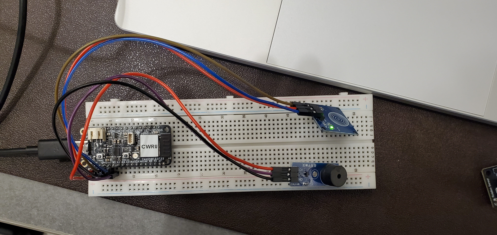

# Lab 5: Integration Exploration
## Submitted by Martin Lopez

This is the last lab using the ESP32 Feather V2 board. 

This lab focuses on integrating sensors and actuators together to create more complex systems. This lab is open-ended, allowing the student the creativity to create any "smart device" that utilizes at least one sensor and one actuator.

I will use the PlatformIO commandline tools and a text editor (Neovim) in Linux to develop and complete the lab.

For this lab, I will use the potentiometer and the Passive Buzzer Module to create a rudimentary drum machine.

the commented source file for my code is in the "src" directory. The basic idea of my device is that the microcontroller recieves the state of the touch sensor and determines if it should register a drum hit. If it senses a drum hit, the program creates a section of the drum sound at every loop iteration for a set amount of rounds.

A picture of the finished circuit can be seen below.

